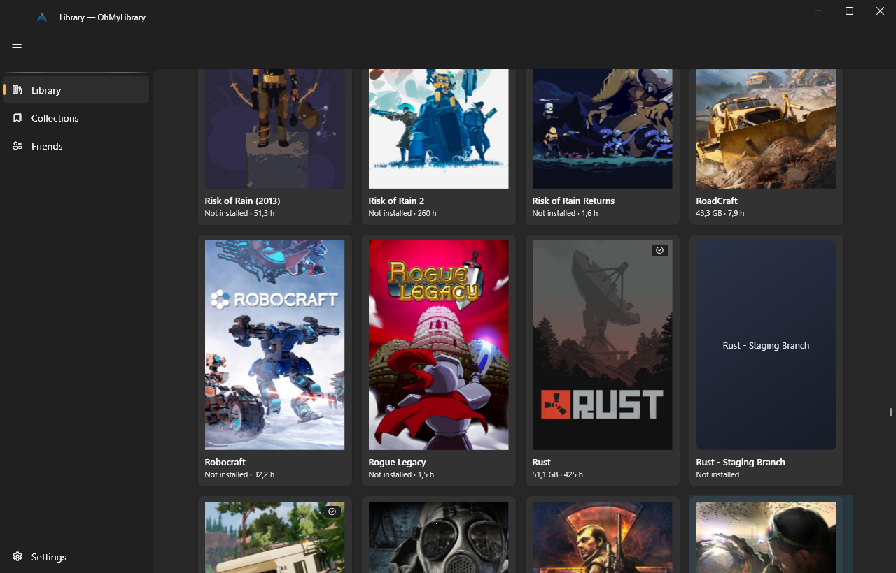

<div align="center">


# OhMyLibrary

A custom Windows launcher layered on top of Steam — your own library view,
collections and tags, built from Steam's local files plus the Steam Web API.

</div>



## What it does

OhMyLibrary reads what Steam already knows and presents it the way you want it.
It never writes into Steam's folders and it never replaces the Steam client —
launching a game still goes through `steam://`, so cloud saves, overlay, controller
config and anti-cheat all behave exactly as they normally do.

- **One library, merged.** Installed games come from `appmanifest_*.acf` across every
  library folder; owned-but-not-installed games come from the Web API. Both land in
  one grid.
- **Real metadata, no scraping.** Genres, store tags, app type and localised names are
  parsed straight out of Steam's binary `appinfo.vdf`. Tag names resolve through Steam's
  public tag endpoint — no API key needed for that part.
- **Local cover art.** Capsules, headers, heroes, logos and icons are read from Steam's
  own `librarycache`. An app with no local art falls back to the CDN, then to a generated
  placeholder — never a broken image.
- **Install, update, launch, verify, uninstall** — all through `steam://` URIs. The
  button on each card follows the app's real state: *Play*, *Install*, *Update*, or a
  progress bar while Steam is working.
- **Live updates.** A debounced `FileSystemWatcher` over every `steamapps` folder means
  a game that finishes installing flips to *Play* on its own. Coming back to the window
  rescans too, throttled so alt-tabbing costs nothing.
- **Search, filter, sort** by name, genre, tag, collection, install state, playtime or
  size — over a virtualised grid that stays responsive with thousands of games.
- **Your own collections**, independent of Steam's categories.
- **Friends** who own a given game, with private profiles shown honestly as
  *game list hidden* rather than as *owns nothing*.

### Graceful degradation is a feature

No Steam client, no library folders, an unplugged library drive, a private profile, no
API key — each of these is a normal state that renders an empty or partial view with an
explanation. None of them is an error, and none of them may throw out of a service.

Without an API key you still get everything local: installed games, art, genres, tags,
launching and installing. Only *owned-but-not-installed* games and the friends list need
a key.

## Requirements

| | |
|---|---|
| OS | Windows 10 or 11 (Mica needs Windows 11; older builds fall back to a solid background) |
| SDK | [.NET 10 SDK](https://dotnet.microsoft.com/download/dotnet/10.0) |
| Architecture | x64 |
| Steam | Optional to build and run. Without it the app starts and shows an empty library. |

## Build and run

```powershell
git clone https://github.com/gordon69/OhMyLibrary.git
cd OhMyLibrary

dotnet build OhMyLibrary.sln
dotnet run --project OhMyLibrary.App
```

That is the whole setup. No API key, no config file and no database to create — the
schema is applied on first connect and the first scan starts as the window appears.

### Tests

```powershell
dotnet test OhMyLibrary.sln                              # everything
dotnet test OhMyLibrary.sln --filter "Category!=Slow"    # fast loop
```

The fast loop runs in a few seconds. The full suite takes around half a minute on
an already-built tree and noticeably longer from a cold clone, because the `Slow`
tests do real disk and layout work.

The `Slow` category is the scaling guard: it builds real libraries of thousands of
manifests and lays out a real page to prove the pipeline stays linear and the grid
keeps recycling containers. Worth running before a release, not on every save.

Parser tests run against fixtures in `OhMyLibrary.Tests/Fixtures`. The binary `appinfo.vdf`
containers are invented outright; the small text formats are scrubbed captures. Provenance is
stated per file in [`OhMyLibrary.Tests/Fixtures/README.md`](OhMyLibrary.Tests/Fixtures/README.md).
Valve changes these formats between client builds, and the fixtures are what catch it.

### Publishing a self-contained build

```powershell
dotnet publish OhMyLibrary.App -c Release -r win-x64 --self-contained
```

## Configuration

Everything is optional. The app works with no configuration at all.

**The easy way:** open **Settings** in the app and paste a key from
[steamcommunity.com/dev/apikey](https://steamcommunity.com/dev/apikey). Your SteamID64 is
detected automatically from the signed-in Steam client, so you rarely need to type it.
Settings are written to `%LOCALAPPDATA%\OhMyLibrary\user-settings.json`.

**The file way:** copy [`appsettings.local.example.json`](appsettings.local.example.json)
to `OhMyLibrary.App/appsettings.local.json` and fill it in. That filename is gitignored.

```jsonc
{
  "Steam": {
    "ApiKey": "…",              // optional; enables owned games and friends
    "SteamId64": "",            // optional; auto-detected from loginusers.vdf
    "Language": "english",      // language for store tag names
    "OverrideSteamPath": ""     // optional; only if auto-detection fails
  }
}
```

> **The API key is a secret.** It is never logged, never shown in full in the UI, and
> never committed — `appsettings.local.json` and `user-settings.json` both live outside
> the repository. Treat a leaked key as compromised and revoke it at the link above.

Refresh cadence lives under `Sync` in
[`appsettings.json`](OhMyLibrary.App/appsettings.json): local files are cheap and rescan
often, the Web API is rate-limited and refreshes on an hours-long TTL or on demand.

## Where your data lives

Everything the app owns is under `%LOCALAPPDATA%\OhMyLibrary\`:

```
library.db            SQLite: games, genres, tags, friends, collections, sync timestamps
logs/omnl-<date>.log  rolling Serilog output, 7 days
imagecache/           art downloaded from the Steam CDN
user-settings.json    settings edited in the app
window.json           remembered window size and position
```

Deleting that folder resets the app completely. Nothing in it is irreplaceable except
your collections.

## Project layout

```
OhMyLibrary.App/    WPF + WPF-UI (Fluent). Views, view models, DI host, theme.
OhMyLibrary.Core/   Domain models, Steam parsers and clients, services. No UI, no SQL.
OhMyLibrary.Data/   SQLite schema and Dapper repositories. No UI, no Steam knowledge.
OhMyLibrary.Tests/  xUnit: parsers, repositories, services, view models, scaling.
```

Dependencies run strictly `App → Data → Core`. Core references neither of the others and
stays free of WPF types, which is what makes the parsers and services testable without a
UI thread.

### Stack

.NET 10 · WPF with [WPF-UI](https://github.com/lepoco/wpfui) 4.3 ·
[CommunityToolkit.Mvvm](https://github.com/CommunityToolkit/dotnet) ·
[ValveKeyValue](https://github.com/ValveResourceFormat/ValveKeyValue) ·
`Microsoft.Data.Sqlite` + Dapper · `HttpClient` + `System.Text.Json` · Serilog

NuGet versions are centralised in
[`Directory.Packages.props`](Directory.Packages.props); a `PackageReference` in a
`.csproj` carries no `Version` attribute.

## Documentation

- [`docs/steam-formats.md`](docs/steam-formats.md) — the on-disk formats, verified byte by
  byte against a live install. **Read this before touching anything under `Vdf/` or
  `Steam/`.** It documents the hand-written `appinfo.vdf` v29 container loop, the hashed
  `librarycache` layout, and why there is no `localization.vdf` any more.
- [`docs/ui-conventions.md`](docs/ui-conventions.md) — the WPF-UI 4.3 API surface as it
  actually exists, plus how pages, view models and navigation are wired.
- [`ohmylibrary-plan.md`](ohmylibrary-plan.md) — the original development plan and stages.
- [`CLAUDE.md`](CLAUDE.md) — conventions and non-negotiables for contributors.

## Status

Early but functional. Stages 0–4 of the plan are implemented: library and launching,
install/update, genres and tags, friends and collections. Verified against a live install
with 86 installed games across 3 library folders and 361 owned titles.

Not yet done: a packaged installer, non-Steam shortcuts, and localisation of the UI
itself (the app is English-only; *store tag* names already follow your chosen language).

## License

[MIT](LICENSE).

OhMyLibrary is not affiliated with, endorsed by, or sponsored by Valve Corporation.
Steam and the Steam logo are trademarks of Valve Corporation.
